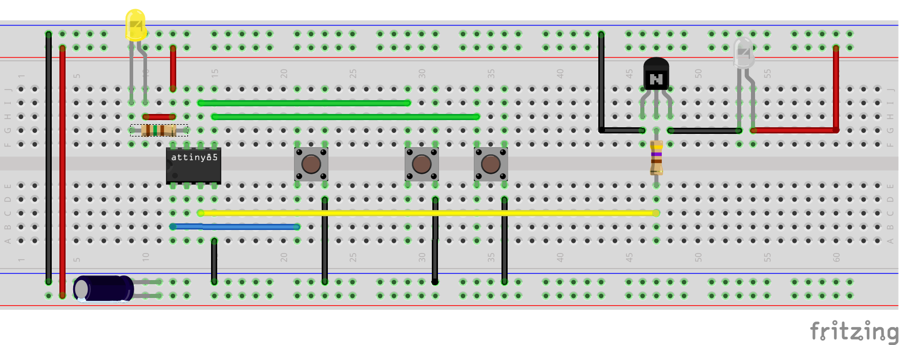

# DubButton

Attiny + IR Led = Dub at the push of a button

```
When we come home from work we need our dub fix.
Our smart TV is extremely slow and unresponsive.
The mobile interface is not any better.
Automation to the rescue!
```

It's basically a one button remote that:

- Powers up the TV
- Opens the youtube app
- Searches a random query based on a list of keywords
- Plays the first returned video


