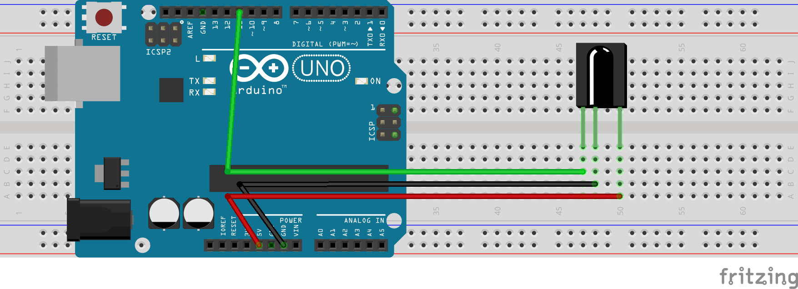

```
This is a simple sketch to debug/monitor the IR output of the DubButton.
Upload it to any arduino board that has a hardware serial,
Connect an IR Receiver to it and open the serial monitor.
```


